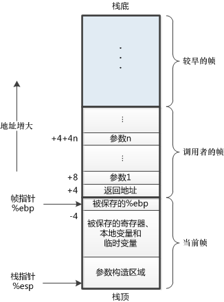

## 栈帧结构
**栈帧**是指为一个函数调用单独分配的那部分栈空间。当运行中的程序调用另一个函数时，就要进入一个新的栈帧，原来函数的栈帧称为调用者的帧，新的栈帧称为当前帧。被调用的函数运行结束后当前帧全部收缩，回到调用者的帧。  
  
这里用到了两个寄存器，`%ebp`是帧指针，它总是指向当前帧的底部；`%esp`是栈指针，它总是指向当前帧的顶部。这两个寄存器用来定位当前帧中的所有空间，在后面的代码中将会经常出现。编译器需要根据IA32指令集的规则小心翼翼地调整这两个寄存器的值，一旦出错，参数传递、函数返回都可能出现问题。
下面来看一个例子。函数`caller`中调用函数`swap_add`，完成交换并相加的工作，C代码如下：
```c
int swap_add(int *xp, int *yp)
{
    int x = *xp;
    int y = *yp;
    *xp = y;
    *yp = x;
    return x + y;
}

int caller()
{
    int arg1 = 534;
    int arg2 = 1057;
    int sum = swap_add(&arg1, &arg2);
    int diff = arg1 - arg2;
    return sum * diff;
}
```
首先，程序从`caller`开始运行，为了详细说明每一行程序都做了什么操作，我们将`caller`函数的C代码编译成汇编码，并给每一句附上注释。
```text
1    caller:
2        pushl %ebp              #Save old %ebp
3        movl %esp, %ebp         #Set %ebp as frame pointer
4        subl $24, %esp          #Allocate 24 bytes on stack
5        movl $534, -4(%ebp)     #Set arg1 to 534
6        movl $1057, -8(%ebp)    #Set arg2 to 1057
7        leal -8(%ebp), %eax     #Compute &arg2
8        movl %eax, 4(%esp)      #Store on stack
9        leal -4(%ebp), %eax     #Compute &arg1
10       movl %eax, (%esp)       #Store on stack
11       call swap_add           #Call the swap_add function
12       ...
```
进入`caller`函数后，先调整两个指针的值，第2行保存旧的帧指针到当前的栈顶位置，第3行将当前栈指针的值赋值给帧指针，此时，帧指针和栈指针都指向栈顶。第4行将栈指针减小24，意思是从栈中申请24字节的空间作为当前帧空间（即`caller`函数所用的帧空间，至于为什么是24字节，我们最后再说）。现在，刚刚完成了预处理工作，接下来就要实现函数体要完成的功能。

分析下一步代码之前，我们先回过头来对照一下前面的栈帧结构图，将`caller`视为调用者的帧，预处理工作完成后，此时的帧指针指向调用者的帧的底部（在图中以我们的视角来看是上面），而栈指针指向调用者的帧的顶部。

在C代码中，我们给两个整型变量分别赋了值。对应的汇编代码为第5行，将`534`存入栈的`-4(%ebp)`位置，这是一个基址+偏移量寻址，即`%ebp`中的数减4的地址。第6行同理。对应栈帧结构图，`534`和`1057`就保存在调用者的帧的底部和参数n之间的某个位置。接下来计算两个整型变量的地址，并将其作为`swap_add`的参数。在汇编代码中，函数调用的参数传递是通过把参数依次放在靠近调用者的帧的顶部来实现的。那么这两个参数就应该放在相对于当前栈顶指针`%esp`的+4和+0位置，第7~10行就在做这个操作。放置好参数后，就可以正式调用函数`swap_add`了，如第11行的指令。`call`指令不仅仅是跳转到子函数的位置，而且还要为子函数的正确返回做准备。事实上，`call`指令可以分为两步，第一步将当前程序段的下一行代码的地址入栈，第二步才是跳转到子函数的代码段，相当于如下两行指令。
```text
pushl [下一句代码的地址]
jmp swap_add
```
至此，在`swap_add`函数代码执行前，调用者的帧已经准备完毕。可以注意到，栈帧结构图中调用者的帧的栈顶正是`call`指令压入的下一行代码的地址，后面将会介绍这个地址的用途。

接下来看`swap_add`函数的汇编代码。
```text
1    swap_add:
2        pushl %ebp              #Save old %ebp
3        movl %esp, %ebp         #Set %ebp as frame pointer
4        pushl %ebx              #Save %ebx

5        movl 8(%ebp), %edx      #Get xp
6        movl 12(%ebp), %ecx     #Get yp
7        movl (%edx), %ebx       #Get x
8        movl (%ecx), %eax       #Get y
9        movl %eax, (%edx)       #Store y at xp
10       movl %ebx, (%ecx)       #Store x at yp
11       addl %ebx, %eax         #Return value = x+y

12       popl %ebx               #Restore %ebx
13       popl %ebp               #Restore %ebp
14       ret                     #Return
```
这段代码被我人为地分割成了三部分。2~4行为预处理部分，同前面分析过的预处理相似，保存旧的帧指针，设置新的帧指针。但多了一步，在第4行将`%ebx`寄存器入栈。该操作是为了保存`%ebx`寄存器的值，以便在函数结束时恢复原值，即第12行的`popl %ebx`。

5~11行为`swap_add`函数的功能实现代码。首先第5、6行从调用者的帧中取出之前保存的两个参数，可以看到，这两个参数相对于当前帧指针的偏移量为+8和+12。然后第7、8行将参数的值作为地址取出对应的两个数（这两个数实际上是`caller`代码中第5、6行存入的数），存入`%ebx`和`%eax`寄存器。第9、10行将两个数交换放回原来的地址。第11行将两个数相加，和作为返回值保存在`%eax`寄存器。

12~14行为结束代码，做一些函数的收尾工作。首先第12行恢复`%ebx`寄存器的值，接着第13行恢复`%ebp`寄存器的值，最后`ret`返回。而`ret`指令也分为两步，第一步取出当前栈顶的值，第二步将这个值作为跳转指令的地址跳转，相当于下面两行代码。
```text
popl %edx
jmp %edx
```
现在可以回收前面的伏笔了。想想看这里弹出的地址是哪来的？不错，正是`call`指令自动压栈的下一行代码的地址。因此，`ret`之后将会执行`call swap_add`指令紧跟着的下一行代码。好的，接下来给出`caller`函数剩下的汇编代码。
```text
12       movl -4(%ebp), %edx
13       subl -8(%ebp), %edx
14       imull %edx, %eax
15       leave
16       ret
```
12~14行都是在完成之后的一些运算而已，不必追究。奇怪的是15行用了一个没见过的指令`leave`，这又是什么意思呢？

我们来分析一下，这段代码和`swap_add`最后三行代码相比，少了两句`popl %ebx`和`popl %ebp`，多了一句`leave`。首先，`popl %ebx`不用考虑了，因为在`caller`的开头并没有`pushl %ebx`，因此也就没必要`popl %ebx`。那么我猜测`leave`是否替代了`popl %ebp`的功能呢？要想弄明白这个问题，首先我们得理解`popl %ebp`到底是什么功能。

很简单，每个函数结束前需要将栈恢复到函数调用前的样子，其实就是恢复两个指针——帧指针和栈指针的位置。`popl %ebp`的作用就是恢复帧指针的位置。而栈指针`%esp`呢？似乎没有看到哪条指令把它恢复。让我们再仔细捋一遍。先看子函数`swap_add`运行过程中的栈指针。使栈指针变化的只有四条语句，2、4行的`pushl`指令和12、13行的`popl`指令，而且两对指令对栈指针的影响正好对消，于是栈指针在函数结束时已经回到了最初的位置，因此根本不需要额外的调整。再考虑`caller`函数，与`swap_add`不同的地方在于第4行申请了24字节的栈空间，即手动将`%esp`寄存器的值减去了24。这就导致函数结束时栈指针无法回到最初的位置，需要我们手动将它恢复，`leave`指令就是这个作用。该指令相当于下面两条指令的合成。
```text
movl %ebp, %esp   #Set stack pointer to the beginning of frame
popl %ebp         #Restore the saved %ebp and set stack pointer to the end of caller's frame
```
先将栈指针恢复到当前帧的起始位置，再恢复帧指针。这样的话，在第二步恢复帧指针的时候栈指针也会自动减一，从而完全退出了当前帧。

最后再来解释栈帧为什么申请了24字节的空间。在现代处理器中，栈帧必须16字节对齐，就是说栈底和栈顶的地址必须是16的整数倍。至于为什么会有这样的要求，请查看下一篇文章《联合、数据对齐和缓冲区溢出攻击》。现在，既然要求是16的整数倍，24字节肯定是不够的，仔细观察就能明白，栈帧除了这额外申请的24字节空间外，还有最初压栈的`%ebp`寄存器占用4字节，以及调用子函数前保存的返回地址占用4字节，加起来正好32字节，实现了16字节对齐。

函数调用时的栈结构变化是个迷人的过程，编译器的精妙之处在此可见一斑。透过现象看本质，我们才真正接触到了程序本身。
## 寄存器使用惯例

在上面的叙述中有一现象尚未解释，为什么`caller`中没有保存`%ebx`而`swap_add`中却保存了呢？这涉及到IA32指令集的寄存器使用惯例，这个惯例保证了函数调用时寄存器的值不会丢失或紊乱。

`%eax`、`%edx`和`%ecx`称为**调用者保存**寄存器，被调用者使用这三个寄存器时不必担心它们原来的值有没有保存下来，这是调用者自己应该负责的事情。

`%ebx`、`%esi`和`%edi`称为**被调用者保存**寄存器，被调用者如果想要使用它们，必须在开始时保存它们的值并在结束时恢复它们的值，一般通过压栈和出栈来实现。

这就可以解释我们的疑问了。由于`%ebx`是被调用者保存寄存器，因此在`swap_add`中我们通过`pushl %ebx`和`popl %ebx`来保存该寄存器的值在函数执行前后不变。

## 这段代码的含义？

下面的代码片段常常出现在库函数的汇编代码中。
```text
    call next
next:
    popl %eax
```
乍看上去好像很奇怪，调用的`next`函数中并没有`ret`语句。这三行代码有什么作用呢？或者说，最后`%eax`寄存器的值会是什么呢？

相信理解了本文前两部分的读者应该很容易分析出来。`call`指令执行时会把下一句代码的地址压栈，此处对应于第三行`popl %eax`的地址。之后跳转到第三行执行，正好把刚才压栈的内容弹出到`%eax`寄存器中，这个值正好是当前的程序计数器的值。

这是汇编代码的一个习惯用法，结果是把`popl`指令地址放入`%eax`中——这是**将程序计数器值放入寄存器的唯一方法**。

参考：
[c语言调用栈](https://z.itpub.net/article/detail/50503CAA1CDDA808A925D5758BD1B0A4)
[函数调用栈分析](https://zhuanlan.zhihu.com/p/376988726)
[c语言调用栈](https://www.cnblogs.com/clover-toeic/p/3755401.html)